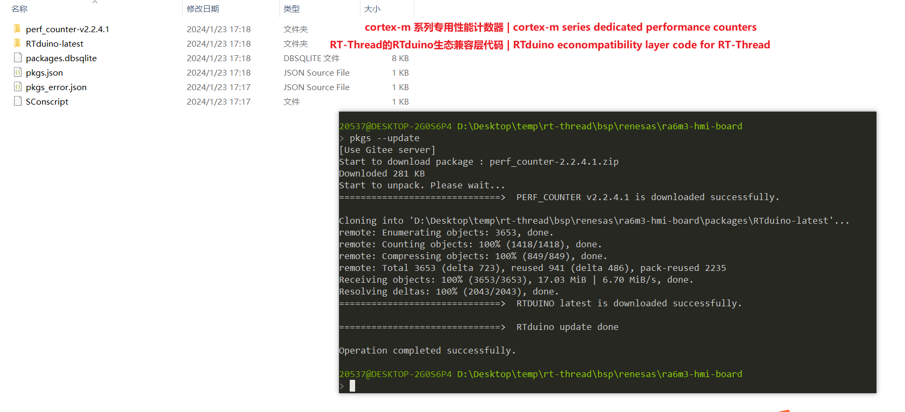
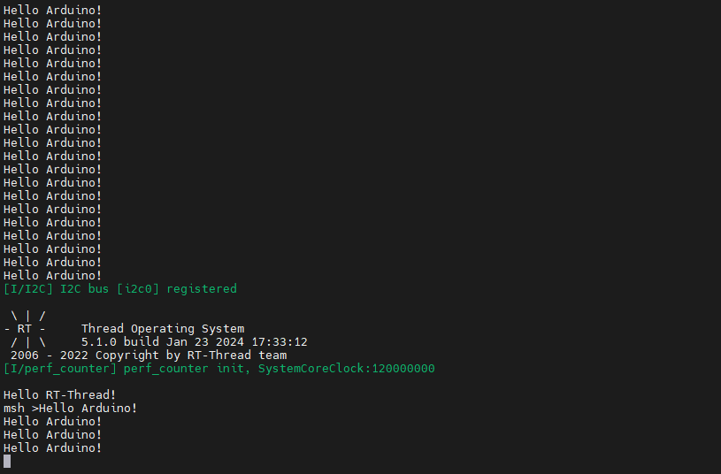
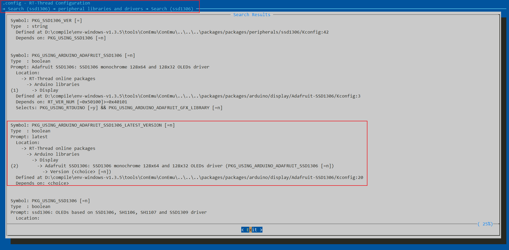
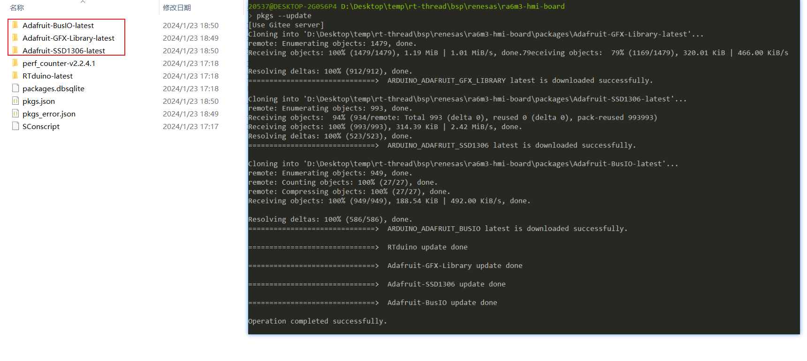
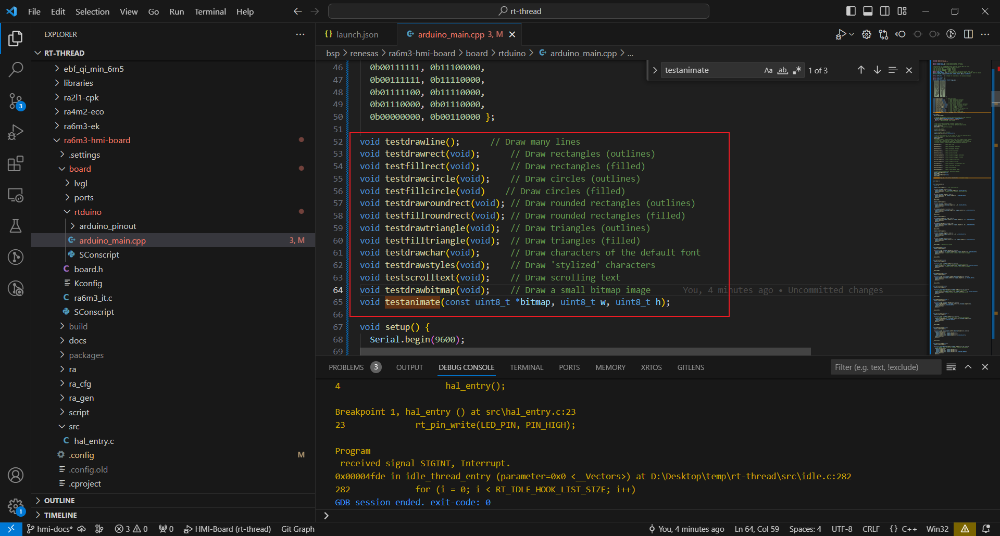

# 瑞萨HMI-Board驱动SSD1306 OLED显示屏

## 1.准备工作

软件环境：

*   [RT-Thread 主仓代码（需下载至本地）](https://github.com/RT-Thread/rt-thread)
*   VSCode
*   RT-Thread Env

硬件环境：

*   RA6M3-HMI-Board 开发板
*   0.96寸 SSD1306 OLED 显示屏

## 2.工程配置

首先我们需要准备好上述所需内容，在将 RT-Thread 源码拉取到本地后，进入如下目录：

```bash
$ cd rt-thread\bsp\renesas\ra6m3-hmi-board
```

这里需要我们提前安装好 ENV 环境，具体细节请参考 [Env编译环境搭建](https://docs.rtduino.com/#/zh/beginner/env?id=env编译环境搭建) 。

鼠标右键打开 ENV 工具后，使用 **menuconfig** 命令打开可视化菜单，勾选上 **RTduino** 的使能项，保存并退出


```bash
RT-Thread Configuration
	 → Hardware Drivers Config
     		→ Onboard Peripheral Drivers
     				[*] Compatible with Arduino Ecosystem (RTduino)
```


此时我们可以注意到在使能该项后，系统会自动勾选上RTduino所需的软件包库及一些系统控制宏，同时我们还需要更新软件包进行下载（注意国内用户需要关闭代理后调用该命令）：

```bash
$ pkgs --update
```

我们可以注意到在 bsp 根目录下生成了一个 packages 目录，并下载了我们所需的 RTduino 依赖库：



## 3.开始编译

打开 ENV ，同时执行如下命令：

```bash
$ scons -j16
```


在工程编译完成后会生成一个 `.elf`后缀的可执行文件，到这里工程的编译就顺利结束了。

## 4.vscode调试配置

首先我们需要在 VSCode 中安装 `Cortex-Debug` 插件，打开 VSCode 扩展，搜索 `Cortex-Debug`并安装扩展：


接下来就是安装 `pyocd` 到本机了，当然也可以使用 python 进行安装，不过我们推荐使用 RT-Thread 官方提供的 pyocd，打开如下链接并下载到本地，这里下载最新版本即可：

```bash
download link: https://github.com/RT-Thread-Studio/sdk-debugger-pyocd/releases
```

接下来就是创建一份 debug 配置文件了，找到 VSCode 左侧菜单栏的调试图标，点击 `create a launch.json file`：


之后 VSCode 会创建一份 `launch.json` 文件，我们需要替换文件内容为：

```json
{
    // Use IntelliSense to learn about possible attributes.
    // Hover to view descriptions of existing attributes.
    // For more information, visit: https://go.microsoft.com/fwlink/?linkid=830387
    "version": "0.2.0",
    "configurations": [
        {
            "name": "HMI-Board",
            "cwd": "${workspaceFolder}",
            "executable": "${workspaceRoot}/bsp/renesas/ra6m3-hmi-board/rtthread.elf",
            "request": "launch",
            "type": "cortex-debug",
            "runToEntryPoint": "main",
            "targetId": "R7FA6M3AH",
            "servertype": "pyocd",
            "serverpath": "D:/compile/sdk-debugger-pyocd/pyocd.bat",
            "armToolchainPath": "D:/toolschain/gcc-arm-none-eabi-10-2020-q4-major-win32/bin",
            "gdbPath": "D:/toolschain/gcc-arm-none-eabi-10-2020-q4-major-win32/bin/arm-none-eabi-gdb.exe",
        },
    ]
}
```

注意：`launch.json`文件中的部分参数需要根据具体位置配置

*   `serverpath`：这部分路径在前面所安装的 `sdk-debugger-pyocd`位置
*   `armToolchainPath`：gcc 工具链，找不到位置的可以[点击此处下载](https://developer.arm.com/-/media/Files/downloads/gnu-rm/10-2020q4/gcc-arm-none-eabi-10-2020-q4-major-win32.exe?revision=9a4bce5a-7577-4b4f-910d-4585f55d35e8&rev=9a4bce5a75774b4f910d4585f55d35e8&hash=9770A44FEA9E9CDAC0DD9A009190CC8B)
*   `gdbPath`

在完成上述配置后就可以点击 `F5` 进行调试了，可能下载速度会比较慢，需要等待一会，调试成功效果如下：


我们点击全速运行，并打开串口终端，可以看到系统启动后会自动打印 RTduino 线程信息：



到这里 RTduino 就已经成功运行在 RT-Thread 啦！

## 5.demo：使用 RTduino 驱动 0.96寸 SSD1306 OLED

在上面的环节中我们已经成功运行 RTduino 了，接下来我们将通过`RTduino`，并在`RT-Thread`中使用 `Arduino` 源码驱动一个 OLED 屏幕。

我们接着回到 ENV 中，使用 `menuconfig`命令打开菜单，同时使用 `shift + /` 打开搜索界面，并且输入：`SSD1306`关键字后回车搜索，在出现的页面我们使用键盘的方向键向下翻找，找到 `Adafruit SSD1306` 对应的 `2` 选项，进入点击 `y` 使能：




这样我们就成功把  `Adafruit SSD1306` 示例库下载到本地了，同时还有一下依赖库：



我们找到路径：`rt-thread\bsp\renesas\ra6m3-hmi-board\packages\Adafruit-SSD1306-latest\examples\ssd1306_128x64_i2c`，可以看到该文件夹下有一个`ssd1306_128x64_i2c.ino`文件，这就是 Arduino 的工程文件，我们复制该文件内容到如下路径下的`arduino_main.cpp`文件中：

```bash
$ cd rt-thread\bsp\renesas\ra6m3-hmi-board\board\rtduino\arduino_main.cpp
```

```c
/*
 * Copyright (c) 2006-2023, RT-Thread Development Team
 *
 * SPDX-License-Identifier: Apache-2.0
 *
 * Change Logs:
 * Date           Author         Notes
 * 2023-10-28     Wangyuqiang    first version
 */

#include <SPI.h>
#include <Wire.h>
#include <Adafruit_GFX.h>
#include <Adafruit_SSD1306.h>

#define SCREEN_WIDTH 128 // OLED display width, in pixels
#define SCREEN_HEIGHT 64 // OLED display height, in pixels

// Declaration for an SSD1306 display connected to I2C (SDA, SCL pins)
// The pins for I2C are defined by the Wire-library. 
// On an arduino UNO:       A4(SDA), A5(SCL)
// On an arduino MEGA 2560: 20(SDA), 21(SCL)
// On an arduino LEONARDO:   2(SDA),  3(SCL), ...
#define OLED_RESET     -1 // Reset pin # (or -1 if sharing Arduino reset pin)
#define SCREEN_ADDRESS 0x3C ///< See datasheet for Address; 0x3D for 128x64, 0x3C for 128x32
Adafruit_SSD1306 display(SCREEN_WIDTH, SCREEN_HEIGHT, &Wire, OLED_RESET);

#define NUMFLAKES     10 // Number of snowflakes in the animation example

#define LOGO_HEIGHT   16
#define LOGO_WIDTH    16
static const unsigned char PROGMEM logo_bmp[] =
{ 0b00000000, 0b11000000,
  0b00000001, 0b11000000,
  0b00000001, 0b11000000,
  0b00000011, 0b11100000,
  0b11110011, 0b11100000,
  0b11111110, 0b11111000,
  0b01111110, 0b11111111,
  0b00110011, 0b10011111,
  0b00011111, 0b11111100,
  0b00001101, 0b01110000,
  0b00011011, 0b10100000,
  0b00111111, 0b11100000,
  0b00111111, 0b11110000,
  0b01111100, 0b11110000,
  0b01110000, 0b01110000,
  0b00000000, 0b00110000 };

void testdrawline();      // Draw many lines
void testdrawrect(void);      // Draw rectangles (outlines)
void testfillrect(void);      // Draw rectangles (filled)
void testdrawcircle(void);    // Draw circles (outlines)
void testfillcircle(void);    // Draw circles (filled)
void testdrawroundrect(void); // Draw rounded rectangles (outlines)
void testfillroundrect(void); // Draw rounded rectangles (filled)
void testdrawtriangle(void);  // Draw triangles (outlines)
void testfilltriangle(void);  // Draw triangles (filled)
void testdrawchar(void);      // Draw characters of the default font
void testdrawstyles(void);    // Draw 'stylized' characters
void testscrolltext(void);    // Draw scrolling text
void testdrawbitmap(void);    // Draw a small bitmap image
void testanimate(const uint8_t *bitmap, uint8_t w, uint8_t h);

void setup() {
  Serial.begin(115200);

  // SSD1306_SWITCHCAPVCC = generate display voltage from 3.3V internally
  if(!display.begin(SSD1306_SWITCHCAPVCC, SCREEN_ADDRESS)) {
    Serial.println(F("SSD1306 allocation failed"));
    for(;;); // Don't proceed, loop forever
  }

  // Show initial display buffer contents on the screen --
  // the library initializes this with an Adafruit splash screen.
  display.display();
  delay(2000); // Pause for 2 seconds

  // Clear the buffer
  display.clearDisplay();

  // Draw a single pixel in white
  display.drawPixel(10, 10, SSD1306_WHITE);

  // Show the display buffer on the screen. You MUST call display() after
  // drawing commands to make them visible on screen!
  display.display();
  delay(2000);
  // display.display() is NOT necessary after every single drawing command,
  // unless that's what you want...rather, you can batch up a bunch of
  // drawing operations and then update the screen all at once by calling
  // display.display(). These examples demonstrate both approaches...

  testdrawline();      // Draw many lines

  testdrawrect();      // Draw rectangles (outlines)

  testfillrect();      // Draw rectangles (filled)

  testdrawcircle();    // Draw circles (outlines)

  testfillcircle();    // Draw circles (filled)

  testdrawroundrect(); // Draw rounded rectangles (outlines)

  testfillroundrect(); // Draw rounded rectangles (filled)

  testdrawtriangle();  // Draw triangles (outlines)

  testfilltriangle();  // Draw triangles (filled)

  testdrawchar();      // Draw characters of the default font

  testdrawstyles();    // Draw 'stylized' characters

  testscrolltext();    // Draw scrolling text

  testdrawbitmap();    // Draw a small bitmap image

  // Invert and restore display, pausing in-between
  display.invertDisplay(true);
  delay(1000);
  display.invertDisplay(false);
  delay(1000);

  testanimate(logo_bmp, LOGO_WIDTH, LOGO_HEIGHT); // Animate bitmaps
}

void loop() {
}

void testdrawline() {
  int16_t i;

  display.clearDisplay(); // Clear display buffer

  for(i=0; i<display.width(); i+=4) {
    display.drawLine(0, 0, i, display.height()-1, SSD1306_WHITE);
    display.display(); // Update screen with each newly-drawn line
    delay(1);
  }
  for(i=0; i<display.height(); i+=4) {
    display.drawLine(0, 0, display.width()-1, i, SSD1306_WHITE);
    display.display();
    delay(1);
  }
  delay(250);

  display.clearDisplay();

  for(i=0; i<display.width(); i+=4) {
    display.drawLine(0, display.height()-1, i, 0, SSD1306_WHITE);
    display.display();
    delay(1);
  }
  for(i=display.height()-1; i>=0; i-=4) {
    display.drawLine(0, display.height()-1, display.width()-1, i, SSD1306_WHITE);
    display.display();
    delay(1);
  }
  delay(250);

  display.clearDisplay();

  for(i=display.width()-1; i>=0; i-=4) {
    display.drawLine(display.width()-1, display.height()-1, i, 0, SSD1306_WHITE);
    display.display();
    delay(1);
  }
  for(i=display.height()-1; i>=0; i-=4) {
    display.drawLine(display.width()-1, display.height()-1, 0, i, SSD1306_WHITE);
    display.display();
    delay(1);
  }
  delay(250);

  display.clearDisplay();

  for(i=0; i<display.height(); i+=4) {
    display.drawLine(display.width()-1, 0, 0, i, SSD1306_WHITE);
    display.display();
    delay(1);
  }
  for(i=0; i<display.width(); i+=4) {
    display.drawLine(display.width()-1, 0, i, display.height()-1, SSD1306_WHITE);
    display.display();
    delay(1);
  }

  delay(2000); // Pause for 2 seconds
}

void testdrawrect(void) {
  display.clearDisplay();

  for(int16_t i=0; i<display.height()/2; i+=2) {
    display.drawRect(i, i, display.width()-2*i, display.height()-2*i, SSD1306_WHITE);
    display.display(); // Update screen with each newly-drawn rectangle
    delay(1);
  }

  delay(2000);
}

void testfillrect(void) {
  display.clearDisplay();

  for(int16_t i=0; i<display.height()/2; i+=3) {
    // The INVERSE color is used so rectangles alternate white/black
    display.fillRect(i, i, display.width()-i*2, display.height()-i*2, SSD1306_INVERSE);
    display.display(); // Update screen with each newly-drawn rectangle
    delay(1);
  }

  delay(2000);
}

void testdrawcircle(void) {
  display.clearDisplay();

  for(int16_t i=0; i<max(display.width(),display.height())/2; i+=2) {
    display.drawCircle(display.width()/2, display.height()/2, i, SSD1306_WHITE);
    display.display();
    delay(1);
  }

  delay(2000);
}

void testfillcircle(void) {
  display.clearDisplay();

  for(int16_t i=max(display.width(),display.height())/2; i>0; i-=3) {
    // The INVERSE color is used so circles alternate white/black
    display.fillCircle(display.width() / 2, display.height() / 2, i, SSD1306_INVERSE);
    display.display(); // Update screen with each newly-drawn circle
    delay(1);
  }

  delay(2000);
}

void testdrawroundrect(void) {
  display.clearDisplay();

  for(int16_t i=0; i<display.height()/2-2; i+=2) {
    display.drawRoundRect(i, i, display.width()-2*i, display.height()-2*i,
      display.height()/4, SSD1306_WHITE);
    display.display();
    delay(1);
  }

  delay(2000);
}

void testfillroundrect(void) {
  display.clearDisplay();

  for(int16_t i=0; i<display.height()/2-2; i+=2) {
    // The INVERSE color is used so round-rects alternate white/black
    display.fillRoundRect(i, i, display.width()-2*i, display.height()-2*i,
      display.height()/4, SSD1306_INVERSE);
    display.display();
    delay(1);
  }

  delay(2000);
}

void testdrawtriangle(void) {
  display.clearDisplay();

  for(int16_t i=0; i<max(display.width(),display.height())/2; i+=5) {
    display.drawTriangle(
      display.width()/2  , display.height()/2-i,
      display.width()/2-i, display.height()/2+i,
      display.width()/2+i, display.height()/2+i, SSD1306_WHITE);
    display.display();
    delay(1);
  }

  delay(2000);
}

void testfilltriangle(void) {
  display.clearDisplay();

  for(int16_t i=max(display.width(),display.height())/2; i>0; i-=5) {
    // The INVERSE color is used so triangles alternate white/black
    display.fillTriangle(
      display.width()/2  , display.height()/2-i,
      display.width()/2-i, display.height()/2+i,
      display.width()/2+i, display.height()/2+i, SSD1306_INVERSE);
    display.display();
    delay(1);
  }

  delay(2000);
}

void testdrawchar(void) {
  display.clearDisplay();

  display.setTextSize(1);      // Normal 1:1 pixel scale
  display.setTextColor(SSD1306_WHITE); // Draw white text
  display.setCursor(0, 0);     // Start at top-left corner
  display.cp437(true);         // Use full 256 char 'Code Page 437' font

  // Not all the characters will fit on the display. This is normal.
  // Library will draw what it can and the rest will be clipped.
  for(int16_t i=0; i<256; i++) {
    if(i == '\n') display.write(' ');
    else          display.write(i);
  }

  display.display();
  delay(2000);
}

void testdrawstyles(void) {
  display.clearDisplay();

  display.setTextSize(1);             // Normal 1:1 pixel scale
  display.setTextColor(SSD1306_WHITE);        // Draw white text
  display.setCursor(0,0);             // Start at top-left corner
  display.println(F("Hello, world!"));

  display.setTextColor(SSD1306_BLACK, SSD1306_WHITE); // Draw 'inverse' text
  display.println(3.141592);

  display.setTextSize(2);             // Draw 2X-scale text
  display.setTextColor(SSD1306_WHITE);
  display.print(F("0x")); display.println(0xDEADBEEF, HEX);

  display.display();
  delay(2000);
}

void testscrolltext(void) {
  display.clearDisplay();

  display.setTextSize(2); // Draw 2X-scale text
  display.setTextColor(SSD1306_WHITE);
  display.setCursor(10, 0);
  display.println(F("scroll"));
  display.display();      // Show initial text
  delay(100);

  // Scroll in various directions, pausing in-between:
  display.startscrollright(0x00, 0x0F);
  delay(2000);
  display.stopscroll();
  delay(1000);
  display.startscrollleft(0x00, 0x0F);
  delay(2000);
  display.stopscroll();
  delay(1000);
  display.startscrolldiagright(0x00, 0x07);
  delay(2000);
  display.startscrolldiagleft(0x00, 0x07);
  delay(2000);
  display.stopscroll();
  delay(1000);
}

void testdrawbitmap(void) {
  display.clearDisplay();

  display.drawBitmap(
    (display.width()  - LOGO_WIDTH ) / 2,
    (display.height() - LOGO_HEIGHT) / 2,
    logo_bmp, LOGO_WIDTH, LOGO_HEIGHT, 1);
  display.display();
  delay(1000);
}

#define XPOS   0 // Indexes into the 'icons' array in function below
#define YPOS   1
#define DELTAY 2

void testanimate(const uint8_t *bitmap, uint8_t w, uint8_t h) {
  int8_t f, icons[NUMFLAKES][3];

  // Initialize 'snowflake' positions
  for(f=0; f< NUMFLAKES; f++) {
    icons[f][XPOS]   = random(1 - LOGO_WIDTH, display.width());
    icons[f][YPOS]   = -LOGO_HEIGHT;
    icons[f][DELTAY] = random(1, 6);
    Serial.print(F("x: "));
    Serial.print(icons[f][XPOS], DEC);
    Serial.print(F(" y: "));
    Serial.print(icons[f][YPOS], DEC);
    Serial.print(F(" dy: "));
    Serial.println(icons[f][DELTAY], DEC);
  }

  for(;;) { // Loop forever...
    display.clearDisplay(); // Clear the display buffer

    // Draw each snowflake:
    for(f=0; f< NUMFLAKES; f++) {
      display.drawBitmap(icons[f][XPOS], icons[f][YPOS], bitmap, w, h, SSD1306_WHITE);
    }

    display.display(); // Show the display buffer on the screen
    delay(200);        // Pause for 1/10 second

    // Then update coordinates of each flake...
    for(f=0; f< NUMFLAKES; f++) {
      icons[f][YPOS] += icons[f][DELTAY];
      // If snowflake is off the bottom of the screen...
      if (icons[f][YPOS] >= display.height()) {
        // Reinitialize to a random position, just off the top
        icons[f][XPOS]   = random(1 - LOGO_WIDTH, display.width());
        icons[f][YPOS]   = -LOGO_HEIGHT;
        icons[f][DELTAY] = random(1, 6);
      }
    }
  }
}
```

在此示例中有几点注意事项：

* 由于我的这款 SSD1306 OLED 显示屏是 i2c 驱动，i2c地址为 `0x3c`，所以对应示例工程中的 `SCREEN_ADDRESS` 需要修改为 `0X3C`


* 由于 Arduino 代码风格是一般不会添加函数声明的，需要我们手动添加一遍



接着我们继续编译工程源码，同时准备接线，由于在这份示例工程中默认使用的是 RTduino 默认的 i2c 设备（具体可查看文件：pins_arduino.h），而这份 bsp 对接 RTduino 默认为 RT-Thread 的软件模拟 i2c0，其对应引脚为：

| pin  |   func   |
| :--: | :------: |
| P203 | i2c0-sda |
| P202 | i2c0-scl |
| VCC  |   vcc    |
| GND  |   gnd    |

接着我们启动调试，在等待下载后可以看到系统初始化会同时启动 RT-Thread main线程和 RTduino线程


查看demo：

